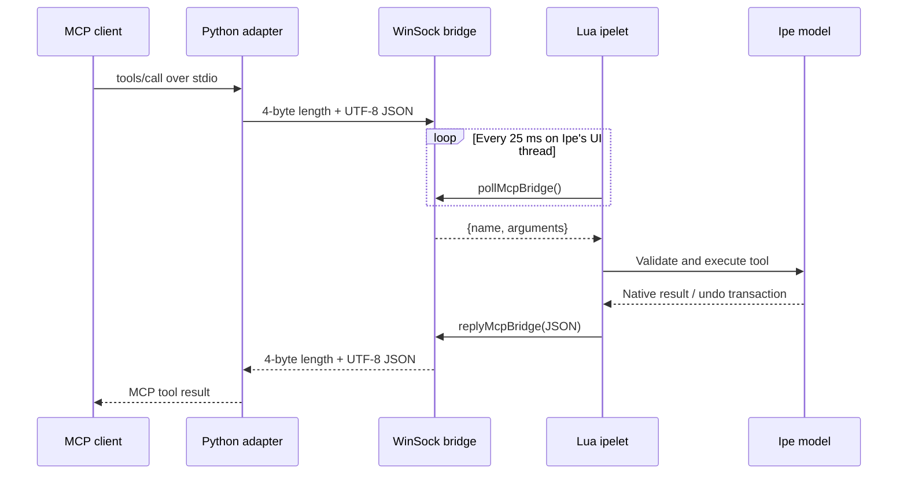

# Architecture

Ipe MCP uses three small layers to connect an MCP client to Ipe without putting
the MCP protocol or a blocking network loop inside the editor process.

## Components

| Component | Language | Location | Responsibility |
|---|---|---|---|
| MCP adapter | Python | `mcp/ipe_mcp_server.py` | Speaks MCP JSON-RPC over stdio, publishes tool schemas, and forwards calls to Ipe |
| Native transport | C++/WinSock | `ipe-7.2.30/src/ipeui/ipeui_mcp_win.cpp` | Owns the loopback listener, frames JSON, and performs non-blocking socket I/O |
| Ipe ipelet | Lua | `ipe-7.2.30/src/ipelets/lua/mcp.lua` | Implements tools against the active Ipe model and controls bridge lifecycle |

The existing Ipe Lua and C++ APIs remain responsible for document parsing,
rendering, window navigation, saving, and undo/redo.

## Request lifecycle



Each MCP tool call opens one loopback connection. The bridge handles one client
and one request at a time, returns its response, and then closes that connection.
This makes the lifecycle deterministic and avoids keeping MCP client state in
Ipe.

## Protocol boundaries

### MCP client to Python

The adapter reads and writes one UTF-8 JSON-RPC message per line on stdio. It
supports sessionless discovery and the listed legacy `initialize` protocol
versions. Notifications do not produce responses.

The tool catalog and JSON Schemas live in `mcp/ipe_mcp_server.py`; they are the
public MCP-facing contract.

### Python to Ipe

The internal bridge protocol is deliberately smaller than MCP. A request is:

```json
{"name":"get_document_info","arguments":{}}
```

The UTF-8 JSON payload is prefixed by a four-byte, little-endian unsigned
length. Responses use the same framing and contain either:

```json
{"ok":true,"result":{"content":[],"structuredContent":{}}}
```

or:

```json
{"ok":false,"error":"human-readable message"}
```

Requests are limited to 16 MiB and responses to 64 MiB. The larger response
limit accommodates rendered PNG image content.

## Threading and editor safety

The WinSock listener and accepted socket are non-blocking. The Lua ipelet checks
for work with an `ipeui.Timer` every 25 milliseconds. Tool implementations run
from that timer callback on Ipe's UI thread, so they use the same model and UI
invariants as normal editor actions.

Mutating tools create Ipe transactions with a cloned original page and register
them through `model:register`. This is why MCP edits appear in Ipe's ordinary
undo history and can be reverted with either the UI or the `undo` tool.

## Rendering and XML

Ipe XML is the structural interchange format:

- object tools accept or return native Ipe object elements;
- page tools use canonical `<ipepage>` XML;
- selection tools use canonical `<ipeselection>` XML;
- Ipe's own parsers validate incoming XML before it reaches the document.

`render_page` asks the active Ipe UI to render a temporary PNG. The ipelet reads
and base64-encodes that file, deletes it immediately, and returns standard MCP
image content.

## Failure handling

- Invalid MCP messages become JSON-RPC errors in the Python adapter.
- Connection failures become MCP tool errors with bridge-start instructions.
- Invalid tool arguments or Ipe XML become tool errors without terminating the
  Python server.
- The native layer rejects empty, oversized, truncated, and malformed frames.
- Ipe startup failures return a nonzero Windows process exit code and are caught
  by the build smoke test.

## Adding a tool

A new tool normally touches three places:

1. Add its public name, description, annotations, and input schema to `TOOLS` in
   `mcp/ipe_mcp_server.py`.
2. Add a function with the same name to `tools` in
   `ipe-7.2.30/src/ipelets/lua/mcp.lua`.
3. Add protocol and compiled-integration coverage under `tests/`.

Prefer canonical Ipe XML for complex structures, validate every index and page
number, and register mutations as one undoable transaction. Read-only tools
should set `readOnlyHint`; destructive or replacement operations should also set
an accurate `destructiveHint`.

The C++ transport does not need to change when adding ordinary tools because it
only carries framed JSON.

## Security properties

The listener binds to `INADDR_LOOPBACK` (`127.0.0.1`) with exclusive address
use. It is stopped until the user starts it from the Ipelets menu and closes when
Ipe exits.

The transport does not authenticate local clients. That is a deliberate
simplicity tradeoff, not a security boundary. Do not forward the port or treat
loopback access as authorization. See [SECURITY.md](../SECURITY.md) for safe use
and vulnerability reporting.
